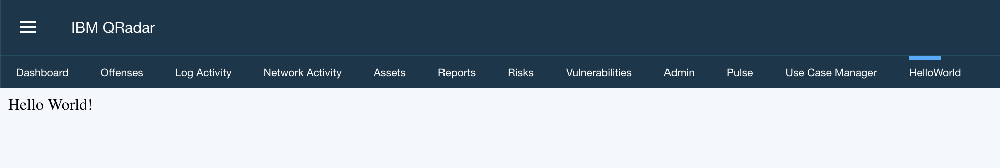

# Creating a Hello World App

When you add an app in the Application Development Manager window, a simple "Hello World" sample app is also created.

The Hello World sample app adds a Hello World tab to QRadar.

The following image shows an example of the Hello World tab that is added to QRadar.



You can use this sample app as a simple template from which to build your own apps that require tabs. When you run the
development environment script, the files that are described in the following table are added to your application
development folder:

<table>
    <tr>
        <th>Files/Folders</th>
        <th>Description</th>
    </tr>
    <tr>
        <td>app</td>
        <td>The root directory which contains the following source code:<p>__init__.py and views.py</p>
        </td>
    </tr>
    <tr>
        <td>__init__.py</td>
        <td>A sample initialisation file that creates an instance of the Flask micro-framework which imports
            views from the views.py script and functions from the qpylib library.</td>
    </tr>
    <tr>
        <td>views.py</td>
        <td>The main entry point into the web application. The file and the manifest.json file are the only files that
            are required in every app. Contains sample code for the Hello World app.</td>
    </tr>
    <tr>
        <td>manifest.json</td>
        <td>Describes to QRadar what the sample Hello World app does.</td>
    </tr>
</table>

> Note: If you're migrating an app from Centos to the app framework v2, the qpylib directory should be removed if it
> exists.

## Application Manifest

The `manifest.json` file contains the following code:

```json
{
    "name":"Hello World App",
    "description":"Simple Hello Word flask app",
    "version":"1.0.0",
    "uuid":"0616bdb3-1c7a-4acf-89a2-4dc726e010bf",
    "image": "QRadar-app-base:2.0.0",
    "areas": [
        {
            "id":"HelloWorldTab",
            "text":"HelloWorld ",
            "description":"Dummy tab that displays text from the flask app",
            "url":"index",
            "required_capabilities":[]
        }
    ]
}
```

The first five objects, `name`, `description`, `version`, `uuid` and `image` provide basic app information.

The `areas` object describes the capabilities of the Hello World app. The QRadar GUI Application Framework uses `areas`
objects to describe new complete pages of the app. Areas objects are represented as tabs in the user interface.

The `areas` block contains the fields that are described in the following table:

<table>
    <tr>
        <th>Name</th>
        <th>Description</th>
        <th>Example Value</th>
    </tr>
    <tr>
        <td>id</td>
        <td>The ID of the new tab</td>
        <td>HelloWorldTab</td>
    </tr>
    <tr>
        <td>text</td>
        <td>The name of the tab that is displayed in the user interface.</td>
        <td>HelloWorld</td>
    </tr>
    <tr>
        <td>description</td>
        <td>A description of the tab that is displayed.</td>
        <td>Dummy tab that displays text from the flask app</td>
    </tr>
    <tr>
        <td>url</td>
        <td>Describes the route that is defined in the views.py script that QRadar uses so it can display the "Hello,
            World!" text in the body of the new tab.</td>
        <td>index</td>
    </tr>
    <tr>
        <td>required_capabilities</td>
        <td>Instructs QRadar to display the Hello World tab only to users with Administrator privileges.</td>
        <td>[]</td>
    </tr>
</table>

## Python Endpoints

The `app/views.py` file contains the following code:

```python
# Licensed Materials - Property of IBM
# 5725I71-CC011829
# (C) Copyright IBM Corp. 2015, 2020. All Rights Reserved.
# US Government Users Restricted Rights - Use, duplication or
# disclosure restricted by GSA ADP Schedule Contract with IBM Corp.


from flask import Blueprint

# pylint: disable=invalid-name
viewsbp = Blueprint('viewsbp', __name__, url_prefix='/')


@viewsbp.route('/')
@viewsbp.route('/index')
def index():
  return "Hello World!"
```

The code creates the default `/` and `/index` routes, both of which return a simple string. The index route is declared
in the url field of the `manifest.json` file.

## App Startup

When QRadar starts your app, it calls the `_init_.py` script. The `_init_.py` file creates an instance of the Flask
microframework environment that imports your views module. Your views modules define all the necessary endpoints and
routes that serve content back to QRadar.

```python
# Licensed Materials - Property of IBM
# 5725I71-CC011829
# (C) Copyright IBM Corp. 2015, 2020. All Rights Reserved.
# US Government Users Restricted Rights - Use, duplication or
# disclosure restricted by GSA ADP Schedule Contract with IBM Corp.


__author__ = 'IBM'

from flask import Flask
from qpylib import qpylib


# Flask application factory.
def create_app():
    # Create a Flask instance.
    qflask = Flask(__name__)

    # Retrieve QRadar app id.
    qradar_app_id = qpylib.get_app_id()

    # Create unique session cookie name for this app.
    qflask.config['SESSION_COOKIE_NAME'] = 'session_{0}'.format(qradar_app_id)

    # Hide server details in endpoint responses.
    # pylint: disable=unused-variable
    @qflask.after_request
    def obscure_server_header(resp):
        resp.headers['Server'] = 'QRadar App {0}'.format(qradar_app_id)
        return resp

    # Register q_url_for function for use with Jinja2 templates.
    qflask.add_template_global(qpylib.q_url_for, 'q_url_for')

    # Initialize logging.
    qpylib.create_log()

    # To enable app health checking, the QRadar App Framework
    # requires every Flask app to define a /debug endpoint.
    # The endpoint function should contain a trivial implementation
    # that returns a simple confirmation response message.
    @qflask.route('/debug')
    def debug():
        return 'Pong!'

    # Import additional endpoints.
    # For more information see:
    # https://flask.palletsprojects.com/en/1.1.x/tutorial/views
    from . import views
    qflask.register_blueprint(views.viewsbp)

    return qflask
```

> Note: You do not have to include the `__author__` tag, but it is considered good practice to use it.

## Conclusion

You can use the Hello World sample app to test the QRadar SDK in these ways:

- Run the Hello World app locally.
- If you have a test instance of QRadar Console, you use the SDK to package and upload the Hello World app to it.
- However, most importantly you can use the Hello World sample app files as a template to start developing your own
QRadar apps.
    - [New tab
    example](https://ibmsecuritydocs.github.io/qradar_appfw_v1/c_appframework_HelloWorldtmplt.html)
    you can build on the Hello World sample app that the IBM® QRadar SDK installs in your app
    workspace to add a tab to QRadar.
